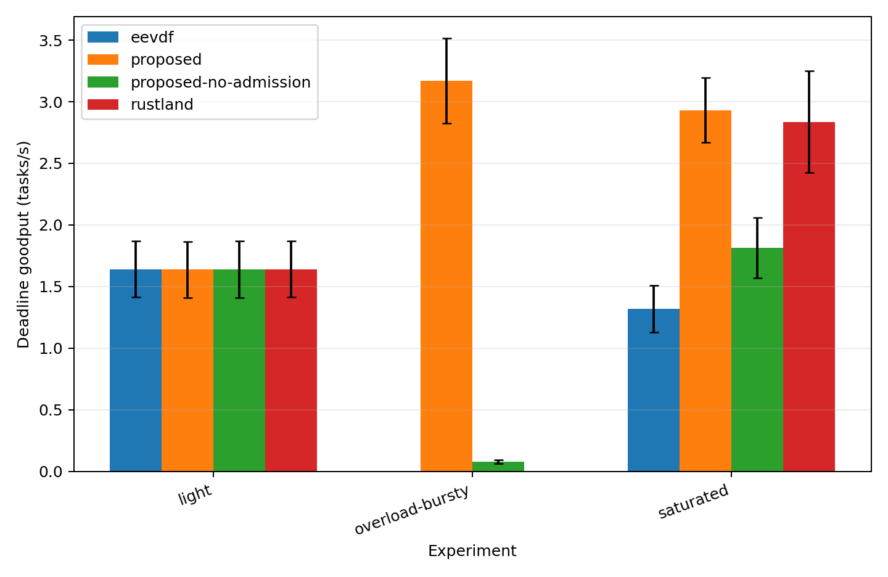
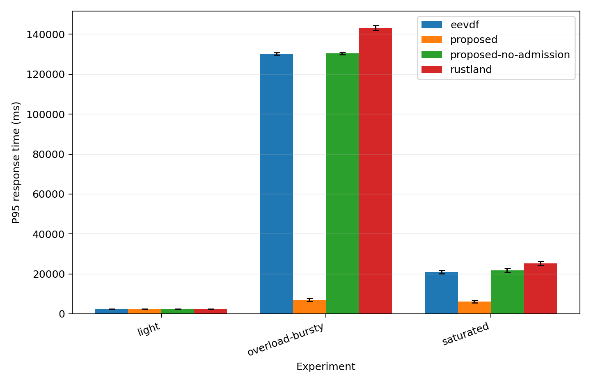
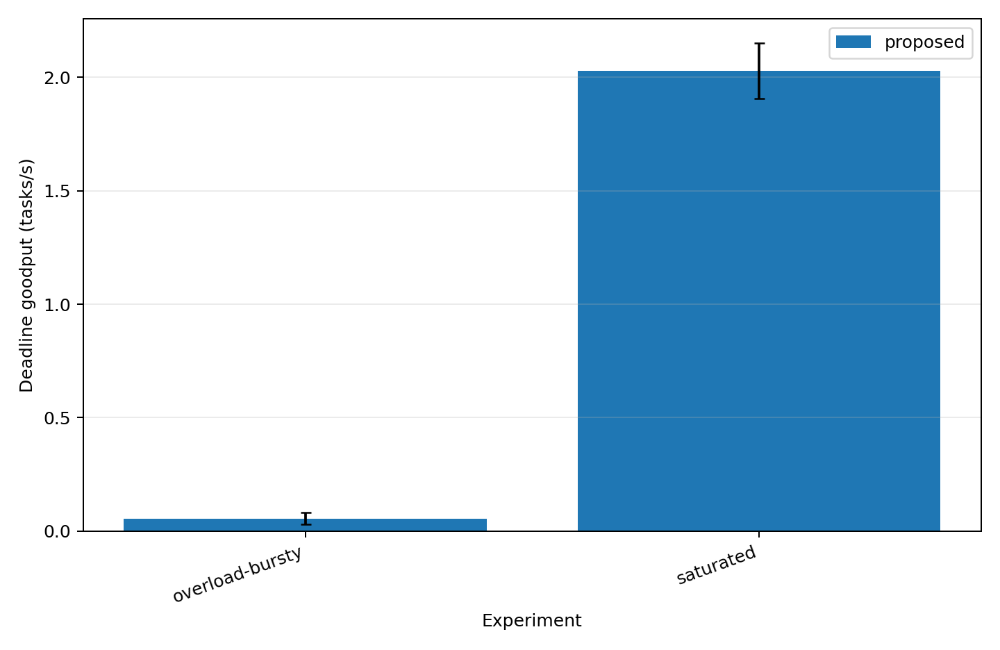
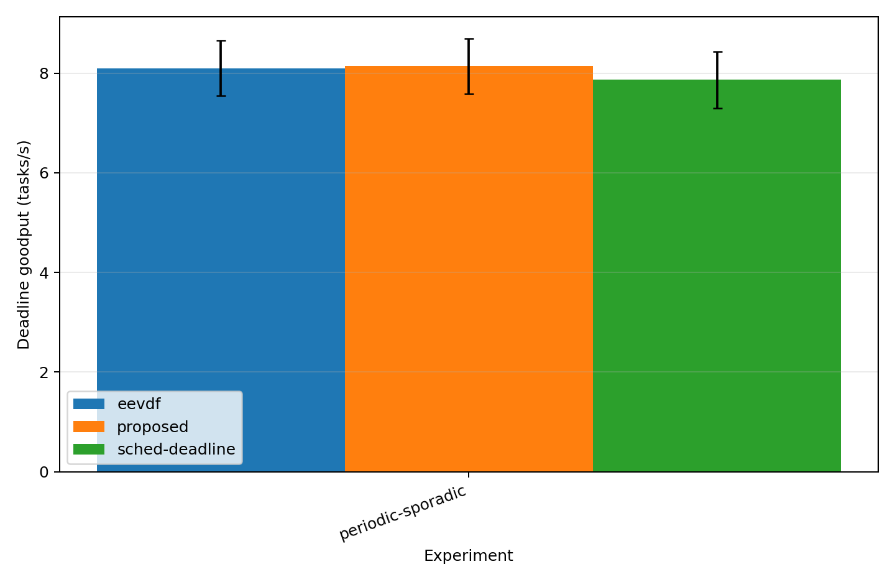

# Final Results — AI Fusion Scheduler

## Evaluation scope and statistical contract

The final primary matrix contains **120 validated runs**: three workload
regimes × four methods × ten repetitions. Each repetition is the statistical
unit; metrics are computed per run and aggregated as the arithmetic mean with
a two-sided Student-t 95% confidence-interval half-width (`n=10`, `df=9`,
`t=2.262`). Rejected deadline-bearing tasks remain in the denominator of
offered deadline goodput. Headline deadline results are therefore reported
together with accepted miss rate, rejection rate, and completion rate.

The primary methods are EEVDF, stock RustLand, AFS without admission, and full
AFS. The tracked secondary evaluation adds 20 no-aging runs, 20
no-application-deadline runs, 30 periodic/sporadic measured runs plus ten
manifest-seed runs, and one completed fusion case study. All 80 standard
secondary validations passed. Pilot and diagnostic runs are excluded from
publication claims.

## Primary matrix

| Workload | Method | Goodput % | Accepted miss % | Rejection % | Completion % | P95 ms | Workload PSI avg10 |
|---|---|---:|---:|---:|---:|---:|---:|
| Light | AFS no admission | 100.00 ± 0.00 | 0.00 ± 0.00 | 0.00 ± 0.00 | 100.00 ± 0.00 | 2473.5 ± 55.4 | 0.80 ± 0.56 |
| Light | EEVDF | 100.00 ± 0.00 | 0.00 ± 0.00 | 0.00 ± 0.00 | 100.00 ± 0.00 | 2447.0 ± 46.6 | 0.18 ± 0.21 |
| Light | Full AFS | 99.82 ± 0.41 | 0.18 ± 0.41 | 0.00 ± 0.00 | 100.00 ± 0.00 | 2469.2 ± 47.5 | 2.31 ± 3.53 |
| Light | RustLand | 100.00 ± 0.00 | 0.00 ± 0.00 | 0.00 ± 0.00 | 100.00 ± 0.00 | 2470.2 ± 52.7 | 0.84 ± 0.92 |
| Saturated | AFS no admission | 53.48 ± 8.14 | 46.52 ± 8.14 | 0.00 ± 0.00 | 100.00 ± 0.00 | 21805.7 ± 1069.8 | 83.09 ± 14.26 |
| Saturated | EEVDF | 38.87 ± 6.62 | 61.13 ± 6.62 | 0.00 ± 0.00 | 100.00 ± 0.00 | 20958.4 ± 783.1 | 82.03 ± 14.27 |
| Saturated | Full AFS | 82.17 ± 3.08 | 7.01 ± 0.94 | 18.05 ± 2.34 | 81.95 ± 2.34 | 6186.9 ± 578.8 | 20.43 ± 4.99 |
| Saturated | RustLand | 83.57 ± 13.06 | 16.43 ± 13.06 | 0.00 ± 0.00 | 100.00 ± 0.00 | 25184.2 ± 1062.9 | 84.84 ± 13.94 |
| Overload | AFS no admission | 1.89 ± 0.31 | 98.11 ± 0.31 | 0.00 ± 0.00 | 100.00 ± 0.00 | 130496.8 ± 623.0 | 94.70 ± 3.69 |
| Overload | EEVDF | 0.00 ± 0.00 | 100.00 ± 0.00 | 0.00 ± 0.00 | 100.00 ± 0.00 | 130276.9 ± 638.8 | 96.11 ± 2.78 |
| Overload | Full AFS | 13.32 ± 1.58 | 37.01 ± 6.36 | 79.38 ± 0.45 | 20.62 ± 0.45 | 7025.8 ± 662.3 | 82.53 ± 4.33 |
| Overload | RustLand | 0.00 ± 0.00 | 100.00 ± 0.00 | 0.00 ± 0.00 | 100.00 ± 0.00 | 143215.0 ± 1171.4 | 99.80 ± 0.16 |

### Light load

All methods are at the near-100% deadline-goodput floor/ceiling regime. Full
AFS records 99.82 ± 0.41% goodput,
0.18 ± 0.41% accepted miss,
0.00 ± 0.00% rejection, and
100.00 ± 0.00% completion. The light
workload should therefore be interpreted as a no-harm/tie regime rather than
as evidence of scheduler superiority.

### Saturation

At saturation, full AFS records
82.17 ± 3.08% offered deadline
goodput, compared with 83.57 ± 13.06%
for RustLand. The RustLand goodput interval is wide and overlaps the AFS
result, so the evidence does **not** support a strong goodput-superiority claim
against RustLand. The more informative trade-off is that full AFS reduces
accepted deadline misses to 7.01 ± 0.94%,
P95 response time to 6186.9 ± 578.8 ms,
and workload PSI avg10 to 20.43 ± 4.99,
while rejecting 18.05 ± 2.34% of
offered tasks and completing 81.95 ± 2.34%.

This is an overload-management trade-off: admission/load shedding improves
the quality and tail latency of the admitted work, but the rejection rate must
remain visible beside goodput and accepted-miss results.

### Overload

The overload regime separates the admission effect most clearly. Full AFS
records 13.32 ± 1.58% offered
deadline goodput, versus 1.89 ± 0.31%
for AFS without admission. Full AFS also lowers P95 response time to
7025.8 ± 662.3 ms, but does so with
79.38 ± 0.45% rejection and only
20.62 ± 0.45% completion. This is
evidence for deliberate overload containment, **not** a free performance win.

## Ablation: aging

| Workload | Variant goodput % | Full AFS goodput % | Variant accepted miss % | Full AFS accepted miss % | Variant rejection % | Full AFS rejection % | Variant P95 ms | Full AFS P95 ms |
|---|---:|---:|---:|---:|---:|---:|---:|---:|
| Saturated | 83.04 ± 2.94 | 82.17 ± 3.08 | 7.72 ± 2.18 | 7.01 ± 0.94 | 16.69 ± 2.28 | 18.05 ± 2.34 | 6439.7 ± 736.3 | 6186.9 ± 578.8 |
| Overload | 10.56 ± 2.09 | 13.32 ± 1.58 | 51.24 ± 8.20 | 37.01 ± 6.36 | 78.97 ± 0.50 | 79.38 ± 0.45 | 6357.2 ± 278.6 | 7025.8 ± 662.3 |

Removing aging has little effect on saturated headline goodput, but under
overload the no-aging variant falls to
10.56 ± 2.09% goodput and rises to
51.24 ± 8.20% accepted misses.
Relative to the full-policy result, the evidence supports aging primarily as a
protection against starvation/deadline-quality degradation in the hardest
load regime, rather than as a universal throughput mechanism.

## Ablation: application-deadline awareness

| Workload | Variant goodput % | Full AFS goodput % | Variant accepted miss % | Full AFS accepted miss % | Variant rejection % | Full AFS rejection % | Variant P95 ms | Full AFS P95 ms |
|---|---:|---:|---:|---:|---:|---:|---:|---:|
| Saturated | 58.70 ± 5.38 | 82.17 ± 3.08 | 15.54 ± 4.81 | 7.01 ± 0.94 | 34.29 ± 2.76 | 18.05 ± 2.34 | 7151.0 ± 656.2 | 6186.9 ± 578.8 |
| Overload | 0.40 ± 0.19 | 13.32 ± 1.58 | 99.02 ± 0.46 | 37.01 ± 6.36 | 60.52 ± 0.00 | 79.38 ± 0.45 | 25495.5 ± 371.0 | 7025.8 ± 662.3 |

This is the strongest secondary ablation. Removing application-deadline
awareness reduces saturated offered deadline goodput to
58.70 ± 5.38% and overload goodput to
0.40 ± 0.19%. Under overload its
accepted miss rate reaches
99.02 ± 0.46%. The result supports
deadline/laxity information as a material part of the AFS policy rather than a
cosmetic metadata feature.

## Periodic/sporadic comparison

| Method | Goodput % | Accepted miss % | Rejection % | Completion % | P95 ms |
|---|---:|---:|---:|---:|---:|
| EEVDF | 99.33 ± 0.67 | 0.67 ± 0.67 | 0.00 ± 0.00 | 100.00 ± 0.00 | 111.0 ± 11.0 |
| Full AFS | 99.87 ± 0.30 | 0.13 ± 0.30 | 0.00 ± 0.00 | 100.00 ± 0.00 | 104.2 ± 6.9 |
| SCHED_DEADLINE | 96.53 ± 1.29 | 3.47 ± 1.29 | 0.00 ± 0.00 | 100.00 ± 0.00 | 147.8 ± 16.3 |

On the dedicated periodic/sporadic workload, full AFS records
99.87 ± 0.30% goodput and
0.13 ± 0.30% accepted misses;
EEVDF records 99.33 ± 0.67% and
0.67 ± 0.67%; SCHED_DEADLINE
records 96.53 ± 1.29% and
3.47 ± 1.29%. These numbers are
specific to the frozen synthetic periodic/sporadic configuration and should
not be generalized into a universal claim over Linux real-time workloads.

## Fusion case study

The completed fusion scenario contains **120 tasks**:
**45 completed**, **75 rejected**, **0 failed**, and
**19 deadline misses**.

The counts above come from the generator's final `summary.json` and are
cross-checked against the 120 task rows in `tasks.csv`. This is a single
case-study execution rather than a ten-repetition statistical group. It
demonstrates end-to-end execution of the heterogeneous fusion pipeline with
AFS admission active, but its raw counts are scenario evidence and are not
generalized as a population estimate.

## Interpretation guardrails

- Always headline offered deadline goodput together with rejection,
  completion, and accepted miss rate.
- Treat the light workload as a floor/tie regime.
- At saturation, describe AFS as approximately matching RustLand goodput while
  improving accepted-miss/tail-latency/pressure behavior at the cost of
  rejection; do not claim statistically established goodput superiority.
- Under overload, describe admission as a load-shedding trade-off. The high
  rejection rate is part of the result, not a footnote.
- Do not use pilot/diagnostic runs for final claims.
- Do not make direct cross-method scheduler-overhead claims from AFS-internal
  counters.
- Keep the periodic/SCHED_DEADLINE result scoped to its frozen workload and
  keep the fusion result scoped to a single case study.

## Evidence provenance

Primary snapshot: `docs/final-results/`

Secondary snapshot: `docs/secondary-results/`

Experimental freeze: `experimental-freeze-v1` /
`edcd8eb347f998fc68c705ca770eaa645c8e78be`

Post-results snapshot branch: `paper-finalization`
